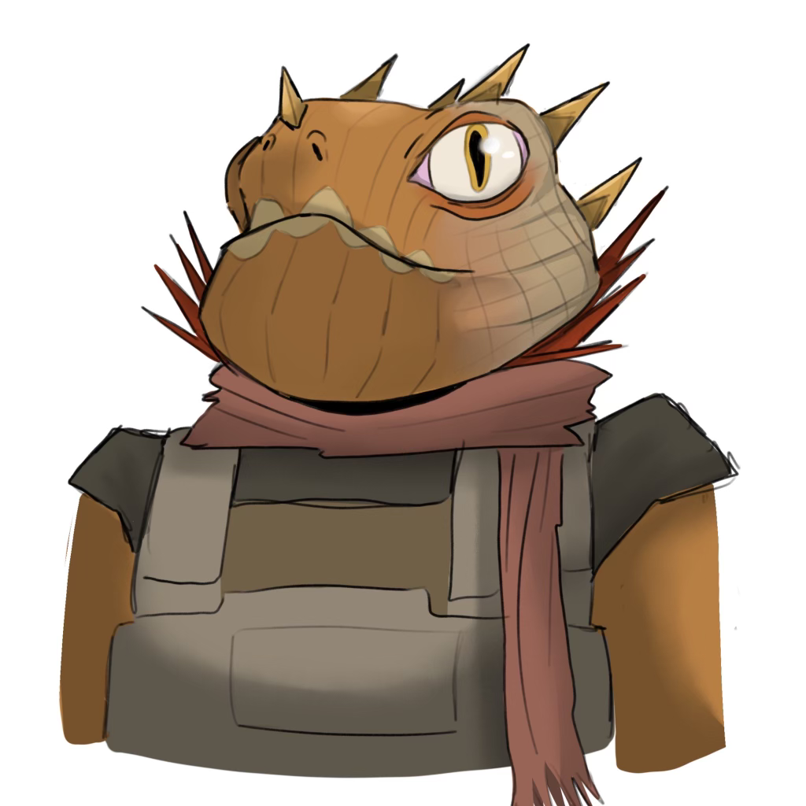
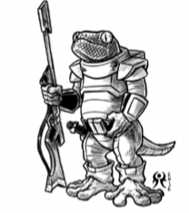
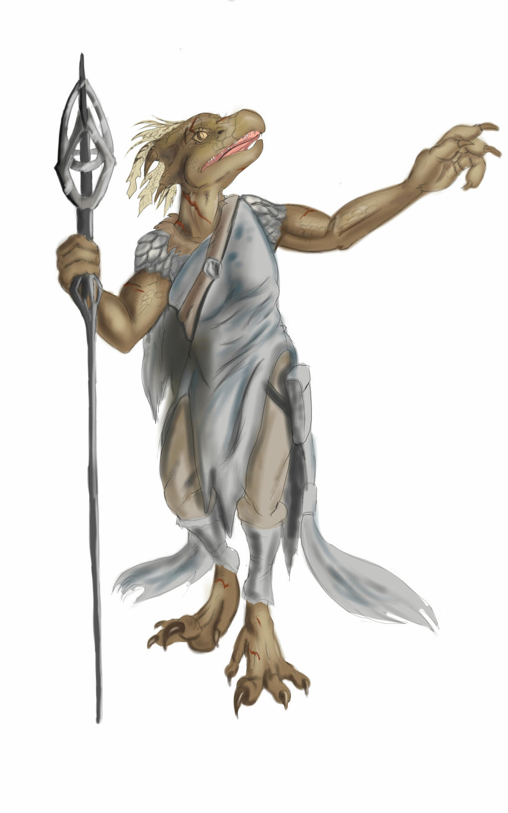

# Blue Star Tribe

The Blue Star Tribe is a group of Cicek on the planet of Alula. They are recent rivals of the Split Stone Tribe

### Luna Whip Tail

[](luna.png)

_Art by @hondahennyball_z on Instagram_

Luna Whip Tail is the ranking female Cicek of the Blue Star Tribe. She is the owner of the **Long Nose**, a 1000-ton freighter. Her husband was Silver Scar, recently deceased.

### Silver Scar

[](scar.png)

Silver Scar founded the Blue Star Tribe about 20 years ago, when his Glory grew high enough to separate from the larger and much more powerful **Seven Spear Tribe**.

### The Long Nose

[](long-nose-battle.png)

Luna Whip Tail's personal starship is the "Long Nose", a 1000-ton L'Ouverture-Class Liberty Ship - Model/B Troop Ship design. It was built by Terrans during the war to transport lots of human troops in cold sleep. But later it was used during the era of intense expansion of Alula, to transport Cicek colonists from other parts of known space to the rapidly developing work posts.

**Silver Scar ** won it as a glory prize, and the **Blue Star Tribe** has been using it for profitable trade since then. It has a large cargo hold, but the main feature is 500 low berths.

[](long-nose.png)


## The Most PIous Vera Slo'mock

* Cicek shaman (psion)
* Religious leader of Blue Star Tribe, in other words the tribe's shaman
* Their tribal religion is a variation of the main religion followed by the Seven Spear Tribe
* Named after Terran President Vera Singh
* Has the ability to speak Terran, with the aid of a synthetic voicebox. This is different than how most Cicek "speak" Terran, which is using computer translator that converts Cicek Trade Tongue to Reticulan and then to Terran, with the associated loss in meaning and lag.

[](vera.jpg)

Like roughly half of Cicek shamans, Vera is biologically male, but plays a female role in society. This is similar to a Terran priest's vow of celibacy. Cicek shamans are female in the sense that they are concerned with the well-being of all tribe members, and don't seek glory. Shamans don't get in fights.


## Xltec-Zodon Wirem "Dominator of Races"

Xltec-Zodon is the presumed next alpha male of Blue Star Tribe, replacing the recently-deceased Silver Scar.

```
Xltec-Zodon 392A4A  Age 42  
Homeworld: Inhospitable Outpost
Male Cicek   7 Terms   Cr1000
Rank 3 (Delta)

Assault Rifle x1, Bow x1, Corsair x2, High Passage x1, Rifle x1

Jack-o-Trades 1, Melee Combat 3, Piloting 2, Stealth 1, Streetwise 2, Zero-G 1, Leadership 1
```

* Low-Light Vision 
* Adhesion Pads
