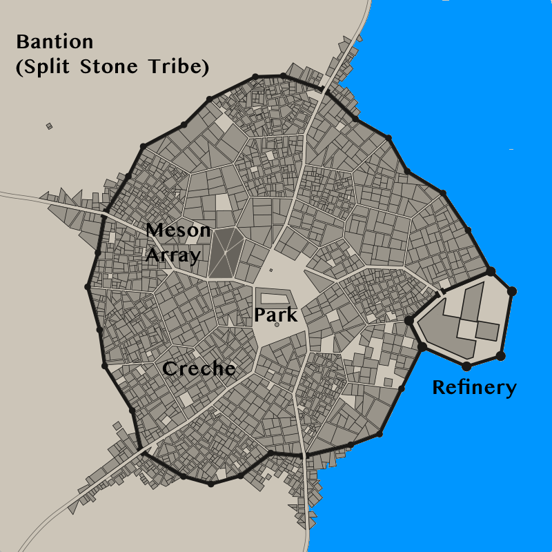

# Split Stone Tribe

The **Split Stone Tribe** is a group of Cicek on the planet Alula. Their recent rivals are the **Blue Star Tribe**.

## Trade Office

The tribe maintains a trade office in Prosperity City, the city that surrounds the surface-side starport at Alula. The highest ranking trade official is a female Cicek with the very utilitarian name of **New Business Relations Manager**.

## Bantion

Bantion is a small city on the edge of a hydrocarbon sea on the surface of Alula. It is the stronghold of the Split Stone Tribe. Like most Cicek stronghold cities on Alula, it contains an extraction/refining area, living areas, administration zone, and a creche for raising young Cicek. It is heavily defended against rival attack.

One of thousands of Cicek employed in the refining operations is **Engineer Level 6 Jack**.

