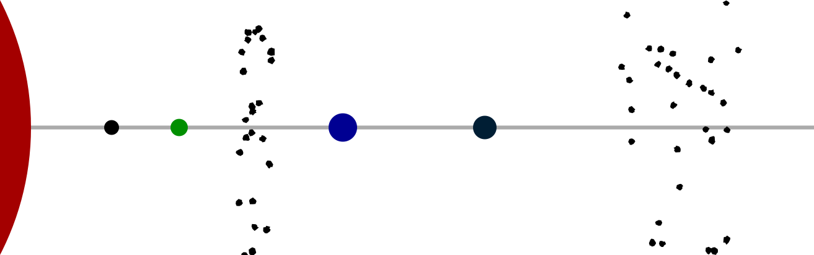
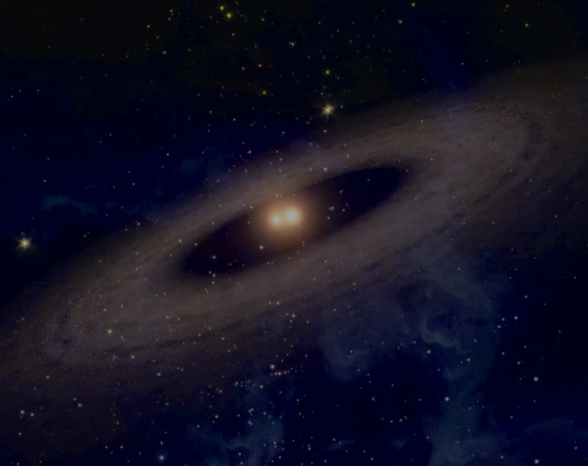
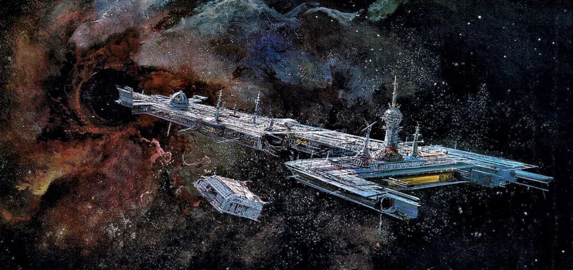

# The Alula System

The Alula system is the “fortified gateway to Cicek space.” It consists of 4 rocky planets and 2 asteroid belts revolving around a double star.

Below is commonly-known information about the Alula system.


_Alula in cross section - created on https://tannerstephens.com/star-system-creator_

## Universal World Profile

Here is the official UWP for Alula:

```
Alula BAA3770-C, Frozen (Xi Ursae Majoris ACd, Frozen, Cicek Confederation)
```


| **Characteristic** | **Value** | **Description** |
|--------------------|-----------|-----------------|
| Starport type      | B         | Good - refined fuel available, maintenance possible |
| World size         | A         | 17100km (1.6g)  |
| Atmosphere         | A         | Exotic (Breather with air supply) |
| Hydrographics      | 3         | Non-water fluid oceans cover 6%, frozen at surface |
| Population         | 7         | 78,000,000 Cicek / 4,000,000 Human / 2,000,000 Other |
| Government         | 7         | Balkanized      |
| Law Level          | 0         | Lawless. All weapons allowed. |
| Tech level         | 12        |                 |
| Classification     | Fl, Ht    | Non-water fluid oceans, High technology |

World name: Xi Ursae Majoris ACd

Nationality: Cicek Confederation

Scout base, navy base, no gas giants, two asteroid belts


_Alula's double stars_


## Background

From *Terra Arisen*:

> Alula is a recent Cicek colony, first settled in 2238 as a fortified waystation on the “Cicek Run”. By the mid-2240’s it grew into a small border fortress and naval refueling station, though the Cicek never did establish a proper naval base there, just a smaller “scout” base. Initially deemed unappealing for settlements, the discovery of highly valuable complex compounds in Alula’s hydrocarbon-rich oceans drew enterprising Cicek tribes to harvest the chemicals and export them both to Cicek and Terran space. The world also remains an important spot on the Terra-Cicek trade route, though secondary in its importance to the more habitable Fei Lian. Typical for the Cicek, no real law exists beyond the tribal level and there are no restrictions on goods or armament. The Nine Fingers tribe operates the starport and stays neutral in the otherwise cutthroat – sometimes literally so – competition between the other four Cicek tribes on the world.


### Xi Ursae Majoris ACb

Rocky planet with no atmosphere or life, bathed in solar radiation


### Xi Ursae Majoris ACc

Rocky planet with carbon dioxide rich atmosphere


### Inner Asteroid Belt

Occupied by Long Tail Tribe, who have a cultural disgust and avoidance of Nine Fingers Tribe. Contact point - trade in vital goods. They are pirates hiding out among the rocks. Ancient ruins dot the rocks.

The belt lies between the 2nd and 3rd planets of the system.


### Xi Ursae Majoris ACd - Alula - Main Planet

Rocky planet with widely separated deep methane lakes, liquid beneath and frozen at the surface

Primary world of the system, and home to the starport. It is the 3rd planet in the Alula system.

There are representatives of all Alula’s tribes here, except for the Long Tail Tribe.


_Alula High Port_

### Xi Ursae Majoris ACe

Rocky planet wracked by volcanoes


### Outer Asteroid Belt

Extremely wide band of asteroid that takes up multiple orbits. Astronomers believe this belt is much younger than the rest of the system, and represents three or even four planets that collided in the not-too-distant past.


## Major Cicek Tribes Present

With 78 million Cicek present in the Alula system, there are thousands of tribes. Many tribes are affiliated or offshoots of other tribes, and the relationships are too complex for most humans to understand or take an interest in. But there are five "major" tribes here. 

A major tribe is one that has its own starships, minor starports (repair stations), supply lines, and ability to project might into other systems. There are minor tribes that have great power on a given planet (infantry, for example) but don't have the ability to protect that planet from spacefaring attackers.

The "power levels" shown below are subjective ratings from the (human-centric) Explorer Society. Beward that power levels change all the time.

### Nine Fingers Tribe

* operates the starport at *Alula Borealis g*
* power level: 2/6


### Seven Spear Tribe

* owners of the *Balanced Spear IX*, the starship wrecked on Brahmagupta (Parvati system) decades ago
* power level: 6/6
* they do not have a presence on Parvati currently


### Rain Tribe

* this is the tribe of Silvertail Stripe, assistant to the Cicek ambassador on Parvati
* power level: 3/6


### Tree Clinging Tribe

* power level: 3/6

### Long Tail Tribe

* inhabit the asteroid belt, known to act mostly as pirates preying on merchant activity (both Cicek and Terran)
* power level: 3/6

