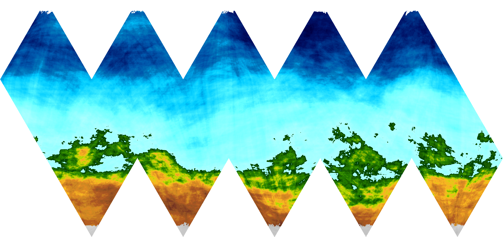
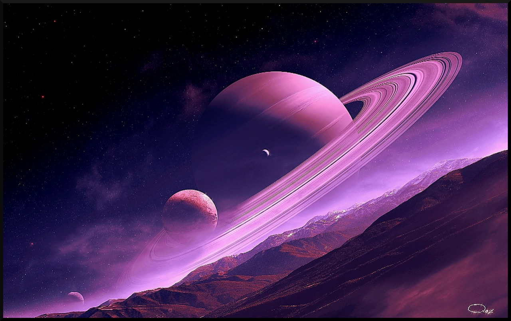
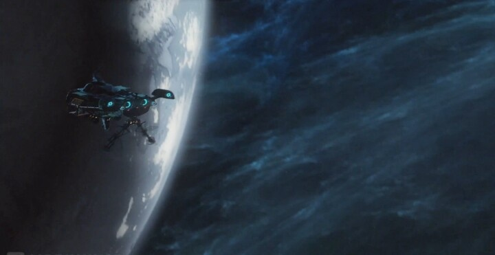

# The Fei Lian System

## Universal World Profile

```
Fei Lian B588740-D, Temperate (Pi1 Ursae Majoris d, G1V, Cicek Confederation)
```


| **Characteristic** | **Value** | **Description** |
|--------------------|-----------|-----------------|
| Starport type      | B         | Good - refined fuel available, maintenance possible |
| World size         | 5         | 8000km (0.45g)  |
| Atmosphere         | 8         | Dense |
| Hydrographics      | 8         | 80% |
| Population         | 7         | 30,000,000, almost all Cicek |
| Government         | 4         | Representative Democracy      |
| Law Level          | 0         | Lawless. All weapons allowed. |
| Tech level         | 13        |                 |
| Classification     | Ag, Ga, Ri    | Agricultural (Ag), Garden (Ga), Rich (Ri) |

World name: Fei Lian

Nationality: Cicek Confederation

Navy base, one gas giant, no asteroid belts


## Background

From *Terra Arisen*:

> Adorned by breathtaking vistas of tall cliffs and hanging forests, Fei Lian is a world of enormous natural beauty. It is also home to the "Fei Lian Dragons", large flying reptilian predators with majestic leathery wings and the ability to spit venom. These creatures drew Cicek hunters to this world in the late 22nd century, following the initial survey. The fertile soil and pleasant climate soon drew Cicek farmers as well. During the War, Fei Lian served as the regional capital of Cicek space and the major transit hub on the famed Cicek Run. This brought an influx of commerce which now continues in peacetime trade with the Terrans. The ruling elected council of tribal matriarchs does not intervene in economic matters and allows enterprising males to seek commercial Glory to their hearts' content. Rich, technologically advanced, and lawless, Fei Lian is a free-for-all market where one can find any imaginable good regardless of its legality in Terran or Reticulan space.

> **Adventuring Information:** Humans are not likely to work as colonists here, but trade and commerce with the Cicek is always lucrative. Just bring enough firepower when negotiations get touchy. Almost any good may be found here, regardless of its rarity or legality. This is a good place to search for expensive, and illegal, specialty gear and weapons, a fact which attracts many wealthy Terran pirates and smugglers to Fei Lian.


### "Jeima Eeno" - Pi1 Ursae Majoris a

Small rock planet, no atmosphere, no moons

A few prospecting operations


### "Jie Eepian" - Pi1 Ursae Majoris b

Corrosive, hothouse planet, no moons

Uninhabited except for two or three scientific research stations


### "Jie Pauhaud" - Pi1 Ursae Majoris c

Unusually large airless rock planet, 43 small moons, 3 large moons

Site of Reticulan naval base that was "glassed" by Cicek nukes in the early days of the war


### "Fei Lian" - Pi1 Ursae Majoris d

The main planet of the system, commonly called Fei Lian, has a surface that is 10% ice, 70% liquid water, and 20% solid.

The northern hemisphere is all liquid water except for a frozen north pole. The single land mass is in the southern hemisphere. It generally rises in elevation from north to south, and the pole is permanently frozen.




Fei Lian has a single small airless moon that is densely inhabited.


#### Starports

The class B starport at Fei Lian is made of several different landing, docking, and repair facilities in various locations.

* a low port on the planet's surface, with multiple antigrav boost plates, capable of six simultaneous controlled, assisted takeoffs or landings; this is the primary passenger terminal for the planet
* a space elevator, terminated at the orbital Cicek Confederation navy base; this is mostly used for cargo transfer to and from orbit
* a low G facility on Fei Lian's single moon
* a stationary zero G repair and fueling facility at the L1 point
* all oceans are free landing and parking areas, except within 45 km of land


### "Veevauen" - Pi1 Ursae Majoris e

Ringed methane jovian planet, 8 small moons with various atmosphere types

Atmosphere is suitable for refining into fuel, freely available for skimming but unguarded




### "Eebora Lian" - Pi1 Ursae Majoris f

Small, cold, twilight-desert world with a convective, biopolluted atmosphere


