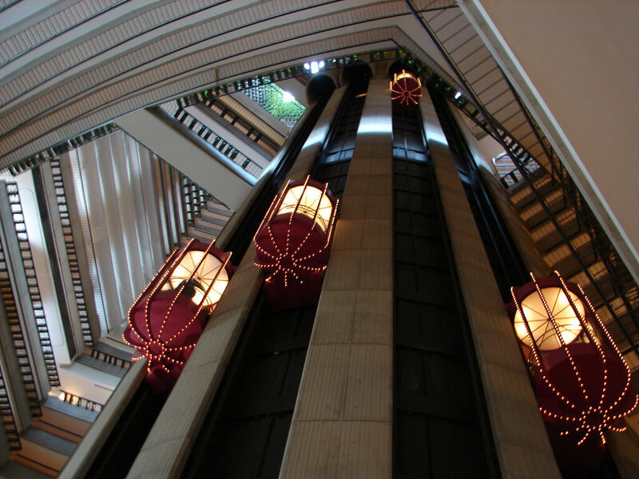

The moon called Parvati (formally Gliese 408 c-4) is home to Parvati Station. It was once a Type B starport, but has since declined to Type D, a shadow of its former glory. There are entire sections that are unused these days. Some of those have been shut off and abandoned, and some hold gangs and squatters.

Years ago, there was both an operational "up port" and "down port". Parvati Up Port was the orbiting part of the starport, where the vast majority of repair and other shipyard services were. Parvati Down Port was mainly used by small craft. 

But the orbital component was destroyed during the war, leaving only the down port, which was renamed from Parvati Down Port to Parvati Station.

[Fill in something about the factions of Parvati - the governor, law enforcement, known contacts, etc.]

# Above Ground Map

This diagram shows the above ground elements of Parvati Station.

# Locations within the Station

* **Udo Station** - this is a section of the station, mainly commercial

* **Captain K’s Refurbishing** - vehicle electronics shop, front for a fence for stolen goods, owned by Mr. Luigi Miotta

* **Vandenberg Vacc and Repair** - vacc suit sales (used and new), repairs, and upgrades

* **Charley’s Authentic Chinese Noodles** - hot food and drink, as well as bulk noodles for spacers; definitely not authentic Chinese food

* **All Peoples Clinic** - basic medical services for Terrans and Cicek; has two or three regular medics and occasionally a fully qualified doctor

* **Office of the Harbormaster** - This is the UTR (United Terran Republic) governmental office, and what makes the starport official. The current Harbormaster is Commodore 

* **Level 4** - Abandoned subterranean level under the starport, was once used for habitation and commerce, but as the starport shrunk people moved out and it was sealed off. Now it is believed to secretly hold an organized crime gang.

* **Marriott Marquis** - Upscale hotel

