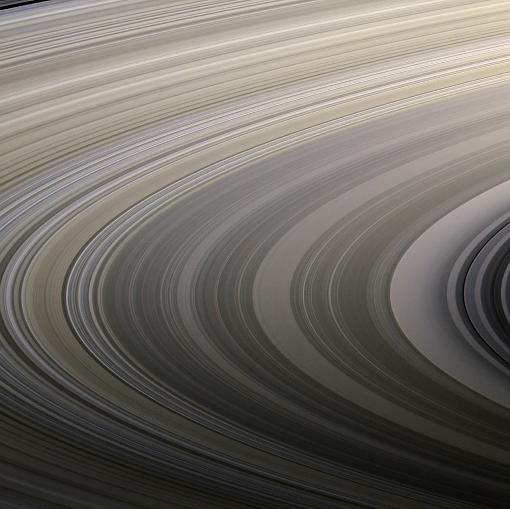

# The Rudra System

The Rudra system is a near neighbor to the Parvati system.

Name origin: *Rudra (/ˈrʊdrə/; Sanskrit: रुद्र) is a Rigvedic deity associated with wind or storm, Vayu and the hunt.*


There are only four places of real interest in the Rudra system:

* **Rudra** - Wolf 359 c: a hostile planet with small boiling caustic oceans
* **Transom Rock** - asteroid with sub-surface city, in orbit around Wolf 359 c
* **Valcent** - Wolf 369 f: a gas giant with an orbiting mass of interconnected ships and cargo containers, inhabited by a human group of separatists that consider themselves independent from the UTR
* **Gamma** - Wolf 396 g: an airless rocky planet that holds a UTR prison (travel here is forbidden)


_Made using Tanner Stephens's [Star System Creator](https://tannerstephens.com/star-system-creator/)_

There are three gas giants, two other smaller planets (in addition to Rudra), and two asteroid belts in the system. But they aren't notable to most travellers.


### Background

> During the war, Rudra used to be the last stop on the “Cicek Run” before entering Cicek space proper. Today, it is a major trading port with the Cicek Confederation. Rudra itself is a hellish world gripped by a runaway greenhouse effect which possesses a caustic atmosphere. The settlement is actually a large orbital station built into a metallic asteroid to protect its residents from Wolf 359’s infrequent but occasionally powerful stellar flares. Of Rudra’s hundred thousand residents, thirty thousand are Cicek traders and colonists. Their presence on this world over the last generation influenced local Terran culture and led to the infamous Rudra informality among humans living here. The official government is content to stand back and let the locals run their own business undisturbed, much to the chagrin of the Ministry of Finance and the Economy, which would prefer a tighter grip on the flow of goods from and to Cicek space.

> Adventuring Information: As the border settles
down, trade with the Cicek is increasing rapidly.
Merchants operating out of Rudra will have a lot of
opportunity for profit. Of course competition means
danger as the existing corporations may begin dirty
trick operations to make any competition feel
especially unwelcome here.


## Rudra and Transom Rock

### Universal World Profile

Here is the official UWP for Rudra, Wolf 359 c:

```
Rudra C8B2521-C, Boiling (Wolf 359 c, M6V, United Terran Republic)
```

| Characteristic | Value | Description |
|----------------|---|---------|
| Starport type  | C | Routine - unrefined fuel available, no maintenance |
| World size     | 8 | 14200km (1.22g) |
| Atmosphere     | B | Corrosive. Space suit required. |
| Hydrographics  | 2 | Non-water fluid oceans cover 26% (boiling) |
| Population     | 5 | 70,000 Humans and 30,000 Cicek |
| Government     | 2 | 	Participatory Democracy: direct democratic rule by the entire population. |
| Law Level      | 1 | Poison gas, explosives, undetectable weapons, weapons of mass destruction banned. |
| Tech level     | C (12) | |
| Classification | 	Fl Ht Ni C3 | Non-water fluid oceans, High technology, Non-industrial, 30% Cicek |

Scout base, no navy, gas giant

Wolf 359 is the star. Rudra is the 2nd planet from the star Wolf 359. Transom Rock orbits Rudra.

**Transom Rock** is a large orbital station built into a metallic asteroid, that was moved from the inner asteroid belt into orbit around Wolf 359 c decades ago. It has 70k Humans and 30k Cicek. 

The humans are torn into two main factions by violent political disagreement. Each views the other as a damnable heresy in need of extirpating. Local government may be able to keep open war from breaking out, but the poisonous hatred divides communities. The nature of the political disagreement is the Cicek. Half of the Terrans treat the Cicek population as friendly neighbors, and the other half want them to return to Cicek space now that the war is over.

### The Starport

Rather than being operated by a commercial contractor, as is done on most other UTR colonies, starport operations at Rudra are currently provided directly by the UTR Ministry of Colonization and Space Travel ("The Scouts").

Unrefined fuel is available at the standard subsidized price of 100 Cr per ton. 

There is no industrial grade fuel refinery, although some entrepreneurial Ciceks have set up a private small-scale refined fuel depot. On any given day, 2D x 10 tons of refined fuel are available for 3D x 100 Cr per ton. The price fluctuates very widely, based on the complexities of inter-tribe competition. Scout warnings abound regarding the unregulated quality of the fuel.


#### Hallway to Rudra Customs Control


#### Visiting the Surface of Rudra


#### Garden District in Transom Rock


## Valcent - Wolf 359 f



Valcent (Wolf 359 f) is a gas giant with an extensive ring belt. In orbit is **Valcent Harbor** and a gas giant mine.

Valcent Harbor is a recent interstellar colony from elsewhere. They have cultural admiration for the Ciceks, and appreciate their freedom. It is occupied by an empoverished separatist group. They need vital supplies.

Valcent Harbor is an orbiting mass of ships and cargo containers, lashed together to form a cluster or swarm of mutually supporting pods of people. The inhabitants are a human group of separatists that consider themselves independent from the UTR.


## Gamma - Wolf 359 g

Wolf 359 g contains a United Terran Republic penal colony. Travel here is forbidden, under threat of death.
